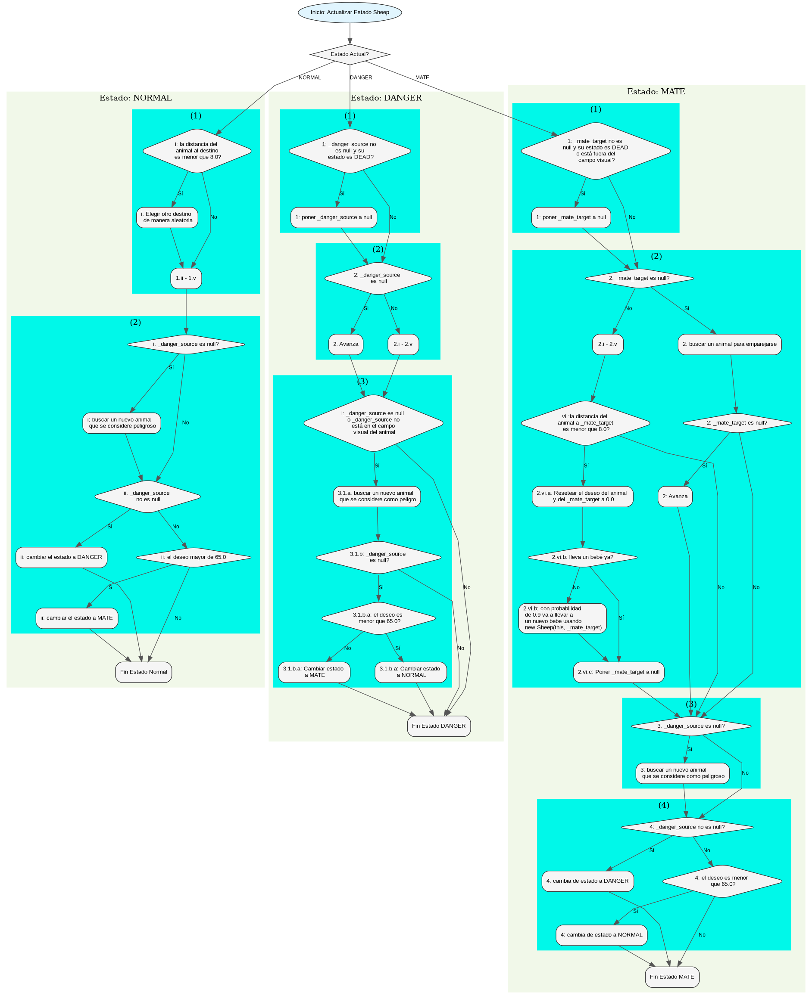
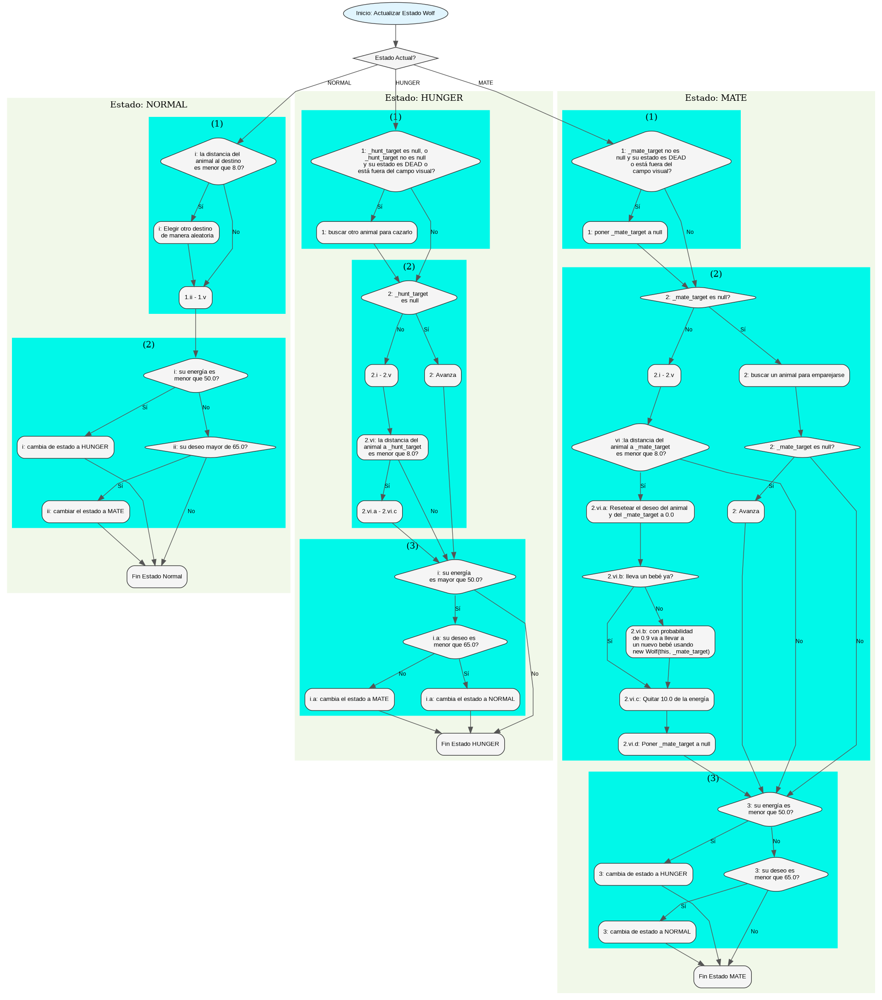

# Práctica 1: Simulador de Ecosistema

**Objetivo:** Diseño orientado a objetos, y uso de genéricos y colecciones.

**Fecha de entrega:** 02 de Marzo 2026, 15:00h

## Control de Copias

### Detección de copias

Durante el curso se realizará control de copias de todas las prácticas, comparando las entregas de todos los grupos de
TP2.
Se considera copia la reproducción total o parcial del código de otros alumnos o cualquier código extraído de Internet o
de cualquier otra fuente, salvo aquellas autorizadas explícitamente por el profesor. En caso de detección de copia, la
calificación en la convocatoria de TP2 en la que se haya detectado la copia será 0.

Si decides almacenar tu código en un repositorio remoto, por ejemplo en un sistema de control de versiones gratuito con
vistas a
facilitar la colaboración con tu compañero de laboratorio, asegúrate de que tu código no esté al alcance de los motores
de búsqueda. Si alguien que no sea el profesor de tu asignatura, por ejemplo un empleador de una academia privada, te
pide que facilites tu código, debes negarte.

### Instrucciones Generales

Las siguientes instrucciones son **estrictas**, es decir, **debes seguirlas obligatoriamente**.

> [!IMPORTANTE]
> Recuerda que este proyecto será un **proyecto Maven**. Tenlo presente. Dedica algo de tiempo a
> familiarizarte con cómo crear / importar tu proyecto en el IDE que utilices

> [!MÁS IMPORTANTE AÚN]
> No pierdas de vista que el examen será en los ordenadores del laboratorio. Dedica tiempo
> a familiarizarte con cómo importar, usar y desarrollar con el entorno que tenemos en el laboratorio

1. Lee el enunciado completo de la práctica antes de empezar.
2. Importa el esqueleto que te proporcionamos como proyecto Maven. Recuerda usar como mínimo `JDK21`.
6. Es **muy importante** que cada miembro del grupo tenga soltura con las advertencias superiores, porque en el examen
   tendrás que hacerlo usando el `src.zip` de tu práctica.
7. Es necesario usar exactamente la misma estructura de paquetes y los mismos nombres de clases que aparecen en el
   enunciado.
8. La generación de números aleatorios se debe hacer usando `Utils._rand` (ver el
   apartado [Generación de Números Aleatorios](#generación-de-números-aleatorios)).
   Está prohibido crear otra instancia de la clase **`Random`** o usar **`Math.random(p)`**.
9. Debes formatear todo el código siguiendo las indicaciones vistas en clase. Puedes apoyarte en la funcionalidad de
   Eclipse (`Source->Format`) o equivalente en tu IDE de preferencia.
10. Todas las constructoras tienen que comprobar la validez de los parámetros y lanzar excepciones correspondientes con
    mensaje informativo (se puede usar `IllegalArgumentException`).
11. En la corrección **tendremos en cuenta el estilo de código**: uso de nombres adecuados para
    métodos/variables/clases, el formateo de código indicado en el punto anterior, etc.
    Revisa las indicaciones vistas en clase.
12. Cuando entregues la práctica sube un fichero con el nombre `src.zip` que incluya solo la carpeta `src` y el
    `pom.xml`. Por favor, por favor
    nada de estructuras anidadas raras en el ZIP. **No está permitido llamarlo con otro nombre ni comprimirlo con 7zip,
    rar, GZip, etc.**

## Descripción General del Simulador

El simulador tiene como objetivo simular un ecosistema compuesto por animales. Los animales en la simulación pueden ser
carnívoros o herbívoros.
En esta práctica, tenemos dos tipos: lobos (carnívoros) y ovejas (herbívoros). Cada animal es un individuo y determina
su propio comportamiento basándose en su entorno y su propio estado. Los estados posibles son: estado normal; buscando a
otro animal para emparejarse; huyendo de otro animal que le resulta peligroso; siguiendo a otro animal para cazarlo,
etc. Cuando los animales se emparejan, pueden nacer otros animales que heredan propiedades de sus genitores. Los
animales mueren cuando alcanzan un límite de edad o se quedan sin energía.

Los animales actualizan sus estados mediante un método `update(double)`, donde el parámetro representa un intervalo de
tiempo que
corresponde a un paso en la simulación (hay que tenerlo en cuenta al actualizar la edad, la posición, etc). Usamos una
clase `Vector2D` para
representar un punto en un plano bidimensional, como la posición de un animal (ver el
apartado [La Clase Vector2D](#la-clase-vector2d)).

La simulación incluye regiones donde se encuentran los animales, y el mundo está compuesto por una matriz de regiones.
Al moverse,
los animales pueden desplazarse de una región a otra. El objetivo de las regiones es proporcionar comida a los animales
cuando lo necesitan.
Vamos a tener varios tipos de regiones que proporcionan comida según criterios distintos. La gestión de las regiones (
añadir animales,
quitar animales, pedir comida, etc.) se hace a través de un gestor de regiones.

La clase principal de la simulación incluye un gestor de regiones y una lista de animales, y permite añadir animales a
la simulación, avanzar
la simulación un paso, consultar el estado, etc. Un paso de la simulación incluye: quitar todos los animales muertos de
la simulación;
actualizar el estado de todos los animales vivos; y hacer nacer a los bebés que llevan los animales.

El bucle principal del simulador avanza la simulación varios pasos durante `T` segundos (por ejemplo, en cada paso
avanza la simulación
`0.003` segundos – el parámetro del método `update` que mencionamos arriba). El bucle muestra el estado actual de los
animales usando el
visor que proporcionamos con la práctica (ver el apartado [El Visor de Objetos](#el-visor-de-objetos)), y además,
escribe el estado inicial
y final de la simulación en un archivo usando el formato `JSON`.

La configuración inicial del mundo se carga desde un archivo en formato `JSON` (ver el
apartado [Análisis y Creación de Datos JSON en Java](#análisis-y-creación-de-datos-json-en-java)).

## La Lógica del Simulador (el modelo)

Todas las clases/interfaces de este apartado tienen que ir en el paquete `simulator.model`.

El modelo incluye clases para representar animales, regiones, gestor de regiones y la clase principal del simulador.
La funcionalidad de cada clase está dividida en varios interfaces para restringir lo que pueden hacer las distintas
partes del simulador
sobre las instancias de esas clases.

> [!NOTE]
> Todos los números que usamos en la formulas a continuación son parámetros que hemos elegido en nuestra implementación
> de la práctica
> para conseguir un comportamiento razonable. Es recomendable definirlos como constantes (como `final static`) para
> poder probar con varios valores.
> También puedes cambiar las fórmulas que usamos y/o los comportamientos de los animales en cada estado, siempre que
> obtengas un comportamiento razonable.
> Ver el apartado [Constantes](#constantes).

### Clases/Interfaces Comunes

#### La Interfaz `JSONable`

Varios objetos de la simulación van a proporcionar su estado en formato `JSON`. Definimos la siguiente interfaz para
implementar esta funcionalidad:

```java
public interface JSONable {
  default public JSONObject as_JSON() {
    return new JSONObject();
  }
}
```

#### La Interfaz `Entity`

Varios objetos de la simulación necesitan actualizar sus estados en cada iteración (en principio los animales y las
regiones).
Definimos la siguiente interfaz para implementar esta funcionalidad:

```java
public interface Entity {
  public void update(double dt);
}
```

### Los Animales

> [!IMPORTANT]
**No está permitido añadir un atributo para la región en las clases de animales.
> Toda la gestión de regiones se tiene que hacer a través del gestor de regiones.**

#### Alimentación (Enumerado)

Los animales pueden ser herbívoros (`HERBIVORE`) o carnívoros (`CARNIVORE`). Definimos un tipo enumerado `Diet` con
estos dos valores.

#### Estado de un Animal (Enumerado)

Los animales pueden estar en uno de los siguientes estados: normal (`NORMAL`), emparejamiento (`MATE`),
hambriento (`HUNGER`), peligro (`DANGER`), o muerto (`DEAD`). Definimos un tipo enumerado `State` con estos `5` valores.

#### La Interfaz `AnimalInfo`

Es una interfaz que define qué información se puede ver sobre un animal. Incluye métodos que consultan el estado del
animal pero nunca lo modifican:

```java
public interface AnimalInfo extends JSONable { // Note that it extends JSONable
  public State get_state();

  public Vector2D get_position();

  public String get_genetic_code();

  public Diet get_diet();

  public double get_speed();

  public double get_sight_range();

  public double get_energy();

  public double get_age();

  public Vector2D get_destination();

  public boolean is_pregnant();
}
```

Cuando queramos pasar una instancia de la clase `Animal` a una parte del programa que no puede alterar el estado,
la vamos a pasar como `AnimalInfo`. Se pueden añadir más métodos si es necesario, siempre que **no alteren** el estado
del animal.

#### Estrategias de Selección de Animales

En algunas circunstancias los animales tendrán que elegir un animal de una lista de animales (que están dentro de su
campo visual).
Por ejemplo, para emparejarse, para buscar un objetivo de caza, etc. Para que los animales puedan tener comportamientos
de selección
distintos (aunque los animales sean del mismo tipo), vamos a usar estrategias de selección. Usaremos la siguiente
interfaz para
representar una estrategia de selección:

```java
public interface SelectionStrategy {
  Animal select(Animal a, List<Animal> as);
}
```

El método `select` selecciona para el animal `a` un animal de la lista `as` según los criterios de la estrategia
concreta
(se supone que el objeto que corresponde al animal `a` invocará a select). Si la lista está vacía, siempre devuelve
`null`.
Se supone que `a` no aparece en la lista `as`.

Implementa las siguientes estrategias:

* `SelectFirst`: devuelvo el primer animal de la lista `as`.
* `SelectClosest`: devuelve el animal más cercano al animal `a` de la lista `as`.
* `SelectYoungest`: devuelve el animal más joven de la lista `as`.

Puedes implementar más estrategias si quieres.

#### La Clase `Animal`

Representamos un animal con la *clase abstracta* `Animal` que implementa las interfaces `Entity` y `AnimalInfo`.
Más abajo vamos a definir `2` tipos de animales que heredan de esta clase.

##### Atributos necesarios

Cada animal tiene que llevar como mínimo los siguiente atributos (pueden ser `protected` para poder acceder directamente
desde las
subclases o `private` y definir `getters` correspondientes):

* `_genetic_code` (`String`): es una cadena de caracteres no vacía que representa el código genético. Cada subclase va a
  asignar un valor distinto a este campo. En principio se usa para saber si 2 animales pueden emparejarse o no (p.ej.,
  si tienen el mismo código genético).
* `_diet` (`Diet`): indica si el animal es herbívoro o carnívoro.
* `_state` (`State`): el estado actual del animal.
* `_pos` (`Vector2D`): la posición del animal.
* `_dest` (`Vector2D`): el destino del animal (el animal siempre tiene un destino, y cuando lo alcanza elige otro, o lo
  cambia según si está siguiendo a otro animal o siendo perseguido por otro animal).
* `_energy` (`double`): la energía del animal. Cuando llega a `0.0` el animal muere.
* `_speed` (`double`): la velocidad del animal.
* `_age` (`double`): la edad del animal. Cuando llega a un máximo (dependiendo del tipo de animal) el animal muere.
* `_desire` (`double`): el deseo del animal, que cambia durante la simulación. Lo vamos a usar para decidir si un animal
  entra en (o sale de) un estado de emparejamiento.
* `_sight_range` (`double`): el radio del campo visual del animal (para decidir qué animales puede ver).
* `_mate_target` (`Animal`): una referencia a un animal con el que quiere emparejarse.
* `_baby` (`Animal`): una referencia que indica si el animal lleva un bebé que no ha nacido aún.
* `_region_mngr` (`AnimalMapView`): es el gestor de regiones para poder consultar información o hacer operaciones
  correspondientes
  (ver el apartado [El Gestor de Regiones](#el-gestor-de-regiones)). Cuando creamos el objeto los inicializamos a
  `null`, hasta que el
  gestor de regiones inicialice el animal llamando a su método `init`.
* `_mate_strategy` (`SelectionStrategy`): es la estrategia de selección para buscar pareja.

##### Constructoras

Es necesario tener `2` constructoras. La primera se usa para crear los objetos iniciales y la segunda para cuando nazca
un animal.

*La primera constructora* es la siguiente (se pueden añadir más parámetros si es necesario)

```java
protected Animal(String genetic_code, Diet diet, double sight_range, double init_speed, SelectionStrategy mate_strategy, Vector2D pos)
```

donde `genetic_code` tiene que ser una cadena de caracteres no vacía, `sight_range` y `init_speed` números positivos y
`mate_strategy` no es null. Hay que lanzar una excepción correspondiente con un mensaje informativo si algún valor es
incorrecto (p.ej., `IllegalArgumentException`).

Los valores de `_genetic_code`, `_diet`, `_sight_range`, `_pos`, y `_mate_strategy` se inicializan a los valores
recibidos. Inicializa `_speed` a `Utils.get_randomized_parameter(init_speed,0.1)` — ver este método en la clase `Utils`.
Nótese que el valor de `pos` puede ser `null` y en ese caso se inicializa a un valor aleatorio en el método `init` (no
en la constructora, ver la descripción del método `init`).

Aparte de los valores recibidos, hay que inicializar los otros atributos de la siguiente manera: `_state` es `NORMAL`,
`_energy` es `100.0`, `_desire` es `0.0`, y `_dest`, `_mate_target`, `_baby` y `_region_mngr` son `null`.

*La segunda constructora* se usa para cuando nazca un animal a partir de otros `2`:

```java
protected Animal(Animal p1, Animal p2)
```

Hay que inicializar los atributos de la siguiente manera: `_dest`, `_baby`, `_mate_target` y `_region_mngr`
son `null`, `_state` es `NORMAL`, `_desire` es `0.0`, `_genetic_code` y `_diet` los hereda de `p1`, `_mate_strategy` lo
hereda de `p2`, `_energy` es la media de las energías de `p1` y `p2`, `_pos` es una posición aleatoria cerca de `p1`
usando por ejemplo:

  ```java
  p1.get_position().

plus(Vector2D.get_random_vector(-1, 1).

scale(60.0*(Utils._rand.nextGaussian() +1)))
  ```

`_sight_range` es una mutación de la media de los campos visuales de `p1` y `p2` usando por ejemplo:

  ```java
  Utils.get_randomized_parameter((p1.get_sight_range() +p2.

get_sight_range())/2,0.2)
  ```

`_speed` es una mutación de la media de la velocidades de `p1` y `p2` usando por ejemplo:

  ```java
  Utils.get_randomized_parameter((p1.get_speed() +p2.

get_speed())/2,0.2)
  ```

##### Métodos necesarios

Además de los métodos de la interfaz que implementa, hay que implementar los siguientes métodos:

* `void init(AnimalMapView reg_mngr)`: el gestor de regiones invocará a este método al añadir el animal a la simulación:

  * Inicializar `_region_mngr` a `reg_mngr`.
  * Si `_pos` es `null` hay que elegir una posición aleatoria dentro del rango del mapa (`X` entre `0` y
    `_region_mngr.get_width()-1` e `Y` entre `0` y `_region_mngr.get_height()-1`). Si `_pos` no es `null` hay que
    ajustarlo para que esté dentro del mapa si es necesario (ver el apartado [Ajustar posiciones](#ajustar-posiciones)).
  * Elegir una posición aleatoria para `_dest` (dentro del rango del mapa).

* `Animal deliver_baby()`: devolver `_baby` y ponerlo a `null`. El simulador invocará a este método para que nazcan los
  animales.

* `protected void move(double speed)`: las subclases usan este método para actualizar la posición del animal (para que
  se mueva hacia _dest con velocidad speed). Esto se puede hace usando

   ```java
   _pos = _pos.plus(_dest.minus(_pos).direction().scale(speed))
   ```

* `protected void set_state(State state)`: cambia el valor de `_state` a `state` y llama a un método correspondiente,
  dependiendo del estado,
  para llevar a cabo alguna accion complementaria. Puede ser como el siguiente, que simplemente llama a un método
  abstracto según el estado
  (ver descripción de los métodos abstractos abajo):

  ```java
	protected void set_state(State state) {
		_state = state;
		switch (state) {
		case NORMAL:
			set_normal_state_action();
			break;
		case HUNGER:
            // ...
		}
	}
  ```

* `abstract protected void set_normal_state_action()`: se implementa en las subclases para ejecutar una acción
  complementaria al cambio de estado correspondiente (p.ej, en la clase `Sheep` pone `_mate_target` y `_danger_source` a
  `null` -- ver la clase [`Sheep`](#la-clase-sheep)).
* `abstract protected void set_mate_state_action()`: se implementa en las subclases para ejecutar una acción
  complementaria al cambio de estado correspondiente (p.ej, en la clase `Sheep` pone `_danger_source` a `null` -- ver la
  clase [`Sheep`](#la-clase-sheep)).
* `abstract protected void set_hunger_state_action()`: se implementa en las subclases para ejecutar una acción
  complementaria al cambio de estado correspondiente (p.ej, en la clase `Wolf` pone `_mate_target` a `null` -- ver la
  clase [`Wolf`](#la-clase-wolf)).
* `abstract protected void set_danger_state_action()`: se implementa en las subclases para ejecutar una acción
  complementaria al cambio de estado correspondiente (p.ej, en la clase `Sheep` pone `_mate_target` a `null` -- ver la
  clase [`Sheep`](#la-clase-sheep)).
* `abstract protected void set_dead_state_action()`: se implementa en las subclases para ejecutar una acción
  complementaria al cambio de estado correspondiente (p.ej, en la clase `Sheep` pone `_mate_target` y `_danger_source` a
  `null` -- ver la clase [`Sheep`](#la-clase-sheep)).

* `public JSONObject as_JSON()`: devuelve una estructura `JSON` como la siguiente:

   ```json
   {
     "pos": [28.90696391797469,22.009772194487613],
     "gcode": "Sheep",
     "diet": "HERBIVORE",
     "state": "NORMAL"
   }
   ```

#### La Clase `Sheep`

Es una clase que representa una oveja. Es un animal herbívoro con código genético `"Sheep"`. Es un animal que no caza a
otros animales,
sólo come lo que proporciona la región en la que está, y puede emparejarse con otros animales con el mismo código
genético.

##### Atributos necesarios

Es necesario mantener una referencia (`_danger_source`) a otro animal que se considera como un peligro en un momento
dado,
y otra referencia (`_danger_strategy`) a una estrategia de selección para elegir un peligro de la lista de animales en
el campo visual.

##### Constructoras

Su *primera constructora*

```java
public Sheep(SelectionStrategy mate_strategy, SelectionStrategy danger_strategy, Vector2D pos)
```

recibe las estrategias y la posición y las almacena en los atributos correspondientes (llamando a la constructora de la
superclase).
El campo de vista inicial es `40.0` y la velocidad inicial es `35.0`.

Su *segunda constructora* se usa para cuando nazca un animal de tipo `Sheep`:

```java
protected Sheep(Sheep p1, Animal p2)
```

Aparte de llamar a la constructora correspondiente de la superclase, tiene que heredar `_danger_strategy` de `p1` y
poner su `_danger_source` a `null`.

##### Métodos Necesarios

Es necesario implementar el método `update`. Este método tiene que hacer lo siguiente:

1. Si el estado es `DEAD` no hacer nada (volver inmediatamente).
2. Actualizar el objeto según el estado del animal (ver la descripción abajo).
3. Si la posición está fuera del mapa, ajustarla y cambiar su estado a `NORMAL`.
4. Si `_energy` es `0.0` o `_age` es mayor de `8.0`, cambiar su estado a `DEAD`.
5. Si su estado no es `DEAD`, pide comida al gestor de regiones usando `get_food(this, dt)` y se añade a su `_energy` (
   manteniéndolo siempre entre `0.0` y `100.0`)

*Para buscar un animal que se considere peligroso*, hay que pedir al gestor de regiones la lista de animales *
*carnívoros** en el campo visual,
usando el método `get_animals_in_range`, y después elegir uno usando la estrategia de selección correspondiente.

*Para buscar un animal para emparejarse*, hay que pedir al gestor de regiones la lista de animales **con el mismo código
genético** en el
campo visual, usando el método `get_animals_in_range`, y después elegir uno usando la estrategia de selección
correspondiente.

Además de lo que explicamos a continuación recuerda que: cuando cambia a estado `NORMAL` tiene que poner
`_danger_source` y `_mate_target` a `null`; cuando cambia a estado `MATE` tiene que poner `_danger_source` a `null`; y
cuando cambia a `DANGER` tiene que poner `_mate_target` a `null`.

> [!IMPORTANT]
> En el punto 2 arriba debes usar un `switch` para distinguir los distintos estados y llamar a otros métodos para llevar
> a cabo la acción correspondiente.
> No se puede incluir todo el código en este método.

##### Cómo Actualizar el Objeto Según el Estado

Diagrama de flujo del los pasos detallados abajo:



Si el estado actual es `NORMAL`:

1. Avanzar el animal según los siguiente pasos:
1. Si la distancia del animal al destino (`_dest`) es menor que `8.0`, elegir otro destino de manera aleatoria (dentro
   de las dimensiones de mapa).
2. Avanza (llamando a `move`) con velocidad `_speed * dt * Math.exp((_energy - 100.0) * 0.007)`.
3. Añadir `dt` a la edad.
4. Quitar `20.0*dt` a la energía (manteniéndola siempre entre `0.0` y `100.0`).
5. Añadir `40.0*dt` al deseo (manteniéndolo siempre entre `0.0` y `100.0`).
2. Cambio de estado
1. Si `_danger_source` es `null`, buscar un nuevo animal que se considere peligroso.
2. Si `_danger_source` no es `null`, cambiar el estado a `DANGER`, y si es `null` y el deseo mayor de `65.0` cambiar el
   estado a `MATE`.

Si el estado actual es `DANGER`:

1. Si `_danger_source` no es `null` y su estado es `DEAD`, poner `_danger_source` a `null` porque ya ha muerto por
   alguna razón y ya no es peligroso.
2. Si `_danger_source` es `null`, avanzar normalmente como el punto 1 del caso `NORMAL` arriba, y si `_danger_source` no
   es `null`:
1. Queremos cambiar el destino para avanzar en la dirección contraria al peligro. Esto se puede hacer con
   `_pos.plus(_pos.minus(_danger_source.get_position()).direction())` como destino.
2. Avanza (llamando a `move`) con velocidad `2.0*_speed*dt*Math.exp((_energy-100.0)*0.007)`.
3. Añadir `dt` a la edad.
4. Quitar `20.0*1.2*dt` a la energía  (manteniéndola siempre entre `0.0` y `100.0`).
5. Añadir `40.0*dt` al deseo  (manteniéndolo siempre entre `0.0` y `100.0`).
3. Cambio de estado
1. Si `_danger_source` es `null` o `_danger_source` no está en el campo visual del animal
1. buscar un nuevo animal que se considere como peligro.
2. Si `_danger_source` es `null`:
1. Si el deseo es menor que `65.0`, cambia el estado a `NORMAL`, en otro caso cámbialo a `MATE`.

Si el estado actual es `MATE`:

1. Si `_mate_target` no es `null` y su estado es `DEAD` o está fuera del campo visual, poner `_mate_target` a `null` ya
   que no lo va a seguir para emparejarse.
2. Si `_mate_target` es `null`, buscar un animal para emparejarse y si no se encuentra uno avanza normalmente como el
   punto 1 del caso `NORMAL` arriba; en otro caso (donde `_mate_target` ya no es `null`):
1. Queremos cambiar el destino para perseguir a `_mate_target`. Esto se puede hacer cambiándolo a
   `_mate_target.get_position()`.
2. Avanza (llamando a `move`) con `velocidad 2.0*_speed*dt*Math.exp((_energy-100.0)*0.007)`.
3. Añadir `dt` a la edad.
4. Quitar `20.0*1.2*dt` a la energía (manteniéndola siempre entre `0.0` y `100.0`).
5. Añadir `40.0*dt` al deseo  (manteniéndolo siempre entre `0.0` y `100.0`).
6. Si la distancia del animal a `_mate_target` es menor que `8.0`, entonces van a emparejarse según los siguientes
   pasos:
1. Resetear el deseo del animal y del `_mate_target` a `0.0`.
2. Si el animal no lleva un bebé ya, con probabilidad de `0.9` va a llevar a un nuevo bebé usando
   `new Sheep(this, _mate_target)`.
3. Poner `_mate_target` a `null`.
3. Si `_danger_source` es `null` buscar un nuevo animal que se considere como peligroso.
4. Si `_danger_source` no es `null` cambia de estado a `DANGER`, y si es `null` y el deseo es menor que `65.0` cambia de
   estado a `NORMAL`.

Si el estado actual es `HUNGER`:

Un objeto de tipo Sheep nunca puede estar en estado `HUNGER`.

#### La Clase `Wolf`

Es una clase que representa un lobo. Es un animal carnívoro con código genético `"Wolf"`.
Es un animal que caza a otros animales herbívoros y también puede comer lo que proporciona la región en la que está,
y puede emparejarse con otros animales con el mismo código genético.

##### Atributos necesarios

Es necesario mantener una referencia (`_hunt_target`) a otro animal al que quiere cazar en un momento dado,
y otra referencia (`_hunting_strategy`) a una estrategia de selección para elegir un animal para cazar.

##### Constructoras:

Su *primera constructora*

```java
public Wolf(SelectionStrategy mate_strategy, SelectionStrategy hunting_strategy, Vector2D pos)
```

recibe las estrategias y la posición y simplemente le almacena en los atributos correspondientes (llamando a la
constructora de la superclase).
El campo de vista inicial es `50.0` y la velocidad inicial es `60.0`.

Su *segunda constructora* se usa para cuando nazca un animal de tipo `Wolf`:

```java
protected Wolf(Wolf p1, Animal p2)
```

Aparte de llamar a la constructora correspondiente de la superclase, tiene que heredar `_hunting_strategy` de `p1` y
poner su `_hunt_target` a `null`.

##### Métodos Necesarios

Es necesario implementar el método `update`. Este método tiene que hacer lo siguiente:

1. Si el estado es `DEAD` no hacer nada (volver inmediatamente).
2. Actualizar el objeto según el estado del animal (ver la descripción abajo)
3. Si la posición está fuera del mapa, la ajusta y cambia su estado a `NORMAL`.
4. Si `_energy` es `0.0` o `_age` es mayor de `14.0`, cambia su estado a `DEAD`.
5. Si su estado no es `DEAD`, pide comida al gestor de regiones usando `get_food(this, dt)` y la añade a su `_energy` (
   manteniéndolo siempre entre `0.0` y `100.0`)

*Para buscar un animal para cazar*, hay que pedir al gestor de regiones la lista de animales **herbívoros** en el campo
visual, usando el método `get_animals_in_range`, y después elegir uno usando la estrategia de selección correspondiente.

*Para buscar un animal para emparejarse*, hay que pedir al gestor de regiones la lista de animales **con el mismo código
genético** en el campo visual, usando el método `get_animals_in_range`, y después elegir uno usando la estrategia de
selección correspondiente.

Además de lo que explicamos a continuación recuerda que: cuando cambia a estado `NORMAL` tiene que poner `_hunt_target`
y `_mate_target` a `null`; cuando cambia a estado `MATE` tiene que poner `_hunt_target` a `null`; cuando cambia a estado
`HUNGER` tiene que poner `_mate_target` a `null`.

> [!IMPORTANT]
> En el punto 2 arriba debes usar un `switch` para distinguir los distintos estados y llamar a otros métodos para llevar
> a cabo la acción correspondiente. No se puede incluir todo el código en este método.

##### Cómo Actualizar el Objeto Según el Estado

Diagrama de flujo del los pasos detallados abajo:



Si el estado actual es `NORMAL`:

1. Avanzar el animal según los siguiente pasos:
1. Si la distancia del animal al destino (`_dest`) es menor que `8.0`, elegir otro destino de manera aleatoria (dentro
   de las dimensiones de mapa).
2. Avanza (llamando a `move`) con velocidad `_speed*dt*Math.exp((_energy-100.0)*0.007)`.
3. Añadir `dt` a la edad.
4. Quitar `18.0*dt` a la energía (manteniéndola siempre entre `0.0` y `100.0`).
5. Añadir `30.0*dt` al deseo (manteniéndolo siempre entre `0.0` y `100.0`).
2. Cambio de estado
1. Si su energía es menor que `50.0` cambia de estado a `HUNGER`, y si no lo es y su deseo es mayor que `65.0` cambia de
   estado a `MATE`. En otro caso no hace nada.

Si el estado actual es `HUNGER`:

1. Si `_hunt_target` es `null`, o no es null pero su estado es `DEAD` o está fuera del campo visual, buscar otro animal
   para cazarlo.
2. Si `_hunt_target` es `null`, avanzar normalmente como el punto `1` del caso `NORMAL` arriba, y si `_hunt_target` no
   es `null`:
1. Queremos cambiar el destino para avanzar hacia el animal que quiere cazar. Esto se puede hacer con
   `_hunt_target.get_position()` como destino.
2. Avanza (llamando a move) con velocidad `3.0*_speed*dt*Math.exp((_energy-100.0)*0.007)`.
3. Añadir `dt` a la edad.
4. Quitar `18.0*1.2*dt` a la energía  (manteniéndola siempre entre `0.0` y `100.0`).
5. Añadir `30.0*dt` al deseo (manteniéndola siempre entre `0.0` y `100.0`).
6. Si la distancia del animal a `_hunt_target` es menor que `8.0`, entonces va a cazar según los siguientes pasos:
1. Poner el estado `_hunt_target` a `DEAD`.
2. Poner `_hunt_target` a `null`.
3. Sumar `50.0` a la energía (manteniéndola siempre entre `0.0` y `100.0`).
3. Cambiar de estado
1. Si su energía es mayor que `50.0`
1. Si el deseo es menor que `65.0` cambia el estado a `NORMAL`, en otro caso cámbialo a `MATE`.

Si el estado actual es `MATE`:

1. Si `_mate_target` no es `null` y su estado es `DEAD` o está fuera del campo visual, poner `_mate_target` a `null` ya
   que no lo va a seguir para emparejarse.
2. Si `_mate_target` es `null`, buscar un animal para emparejarse y si no se encuentra uno avanza normalmente como el
   punto 1 del caso `NORMAL` arriba; en otro caso (`_mate_target` ya no era `null`):
1. Queremos cambiar el destino para perseguir a `_mate_target`, esto se puede hacer con `_mate_target.get_position()`
   como destino.
2. Avanza (llamando a move) con velocidad `3.0*_speed*dt*Math.exp((_energy-100.0)*0.007)`.
3. Añadir `dt` a la edad.
4. Quitar `18.0*1.2*dt` a la energía (manteniéndola siempre entre `0.0` y `100.0`).
5. Añadir `30.0*dt` al deseo  (manteniéndola siempre entre `0.0` y `100.0`).
6. Si la distancia del animal a `_mate_target` es menor que `8.0`, entonces van a emparejarse según los siguientes
   pasos:
1. Resetear el deseo del animal y del `_mate_target` a `0.0`.
2. Si el animal no lleva un bebe ya, con probabilidad de `0.9` va a llevar a un nuevo bebe usando
   `new Wolf(this, _mate_target)`.
3. Quitar `10.0` de la energía (manteniéndola siempre entre `0.0` y `100.0`).
4. Poner `_mate_target` a `null`.
3. Si su energía es menor que `50.0` cambia de estado a `HUNGER`, y si no lo es y el deseo es menor que `65.0` cambia de
   estado a `NORMAL`.

Si el estado actual es `DANGER`:

Un objeto de tipo Wolf nunca puede estar en estado `DANGER`.

### Regiones

Las regiones son zonas donde se encuentran los animales. Las regiones proporcionan comida según distintos criterios.

#### La Interfaz `FoodSupplier`

Usamos la siguiente interfaz para pedir comida para el animal `a` durante `dt` segundos:

```java
public interface FoodSupplier {
  double get_food(AnimalInfo a, double dt);
}
```

#### La Interfaz `RegionInfo`

Es una interfaz que define qué información se puede ver sobre una región e incluye métodos que consultan el estado de la
región pero nunca lo modifican. De momento la interfaz solo extiende `JSONable`, más adelante añadiremos más métodos.

```java
public interface RegionInfo extends JSONable {
  // for now it is empty, later we will make it implement the interface
  // Iterable<AnimalInfo>
}
```

#### La Clase `Region`

Representamos una región con la clase abstracta Region que implementa las interfaces `Entity`, `FoodSupplier` y
`RegionInfo`.

##### Atributos necesarios

Un atributo con la lista de animales que se encuentran en la región. Mantenerlo protected para poder acceder
directamente desde las subclases.

##### Constructoras

Tiene solo una constructora por defecto que inicializa la lista de animales.

##### Métodos necesarios

Además de los métodos de la interfaz que implementa, hay que implementar los siguientes métodos:

* `final void add_animal(Animal a)`: añade el animal `a` la lista de animales.

* `final void remove_animal(Animal a)`: quita el animal de la lista de animales.

* `final List<Animal> getAnimals()`: devuelve una versión **inmodificable** de la lista de animales.

* `public JSONObject as_JSON()`: devuelve una estructura `JSON` como la siguiente donde `ai` es lo que devuelve
  `as_JSON()` del animal correspondiente:

   ```json
     {
       "animals": [a1,a2,...]
     }
   ```

#### La Clase `DefaultRegion`

La clase `DefaultRegion` representa una región que da comida sólo a animales herbívoros. No tiene constructoras (solo la
constructora por defecto, que está definida automáticamente),

Su método `get_food(a,dt)` devuelve `0.0` si el animal que pide comida es carnívoro, y lo siguiente si es herbívoro
donde `n` es el número de animales herbívoros en la región:

```java
60.0*Math.exp(-Math.max(0, n-5.0)*2.0)*dt
```

Su método `update` no hace nada.

#### La Clase DynamicSupplyRegion

La clase `DynamicSupplyRegion` representa una región que da comida sólo a animales herbívoros, pero la cantidad de
comida puede decrecer/crecer. Su constructora recibe la cantidad inicial de la comida (número positivo de tipo `double`)
y un factor de crecimiento (número no negativo de tipo `double`).

Su método `get_food(a,dt)` devuelve `0.0` si el animal que pide comida es carnívoro, y lo siguiente si es herbívoro
donde `n` es el número de animales herbívoros en la región y `_food` es la cantidad actual de comida:

```java
Math.min(_food,60.0*Math.exp(-Math.max(0, n-5.0)*2.0)*dt)
```

Además quita el valor devuelto a la cantidad de comida `_food` que tiene la región actualmente. Su método `update`
incrementa, con probabilidad `0.5`, la cantidad de comida por `dt*_factor` donde `_factor` es el factor de crecimiento.

### El Gestor de Regiones

El gestor de regiones es una clase que facilita el trabajo con regiones. Representa un mapa con altura y anchura fijas y
mantiene una matriz de regiones (con números de columnas y filas fijas). Se puede tanto registrar un animal (y lo coloca
en su región), como eliminar un animal (y lo quita de su región). Un animal puede pedir comida al gestor y el gestor
delega la petición a la región correspondiente, etc.

#### La Interfaz `MapInfo`

Es una interfaz que representa el mapa y nos permite consultar información pero nunca modificar el mapa.

```java
public interface MapInfo extends JSONable {
  public int get_cols();

  public int get_rows();

  public int get_width();

  public int get_height();

  public int get_region_width();

  public int get_region_height();
}
```

#### La Interfaz `AnimalMapView`

Es una interfaz que representa lo que un animal puede ver del gestor de regiones. En principio puede ver el mapa, pedir
comida, y además puede pedir la lista de animales en su campo visual que además satisfacen alguna condición.

```java
public interface AnimalMapView extends MapInfo, FoodSupplier {
  public List<Animal> get_animals_in_range(Animal e, Predicate<Animal> filter);
}
```

#### La Clase `RegionManager`

Representamos el gestor de regiones con la clase `RegionManager` que implementa la interfaz `AnimalMapView`.

##### Atributos necesarios

Tiene que mantener información básica sobre el mapa (anchura/altura de mapa, columnas, filas, anchura/altura de una
región). Además, tiene que mantener una matriz de regiones con número de filas y columnas correspondientes (`_regions`),
y un mapa (`_animal_region`) de tipo `Map<Animal, Region>` que asigna a cada animal su región actual.

##### Constructoras

Hay solo una constructora que recibe el número de columnas, el número de filas, la anchura, y la altura.

```java
public RegionManager(int cols, int rows, int width, int height)
```

Tiene que almacenar los parámetros en los atributos correspondientes, y calcular la anchura y altura de una celda (
dividir anchura/altura total por el número de columnas/filas) y almacenarlo en los atributos correspondientes. Además,
debe inicializar la matriz `_regions` con regiones de tipo `DefaultRegion` (usando la constructora por defecto) e
inicializar `_animal_region` con una estructura de datos adecuada.

##### Métodos necesarios

Además de los métodos de la interfaz que implementa, hay que implementar los siguientes métodos:

* `void set_region(int row, int col, Región r)`: modifica la región localizada en la columna `row` y fila `col` a `r`.
  Además añade todos los animales que estaban en la región anterior a `r` y actualiza sus entradas en `_animal_region`.

* `void register_animal(Animal a)`: encuentra la región a la que tiene que pertenecer el animal (a partir de su
  posición) y lo añade a esa región y actualiza `_animal_region`. Además, llama al método `init` pasándole una
  referencia a sí mismo (el gestor de regiones).

* `void unregister_animal(Animal a)`: quita el animal de la región a la que pertenece y actualiza `_animal_region`.

* `void update_animal_region(Animal a)`: encuentra la región a la que tiene que pertenecer el animal (a partir de su
  posición actual), y si es distinta de su región actual lo añade a la nueva región, lo quita de la anterior, y
  actualiza `_animal_region`.

* `public double get_food(AnimalInfo a, double dt)`: llama a `get_food` de la región a la que pertenece el animal y
  devuelve el valor correspondiente.

* `void update_all_regions(double dt)`: llama a `update` de todas la regiones en la matriz de regiones.

* `public List<Animal> get_animals_in_range(Animal a, Predicate<Animal> filter)`: devuelve un lista de todos los
  animales que están en el campo visual del animal `a` y cumplen la condición `filter`. Debe consultar sólo las regiones
  en el campo visual.

* `public JSONObject as_JSON()`: devuelve una estructura `JSON` de la siguiente forma

```json
  {
  "regiones": [
    o1,
    o2,
    ...
  ]
}
```

donde `oi` es una estructura JSON que corresponde a una región y tiene la siguiente forma

```json
 {
  "row": i,
  "col": j,
  "data": r
}
```

donde `r` es lo que devuelve `as_JSON()` de la región en la fila `i` y columna `j`.

### La Clase `Simulator`

Esta es la clase principal del modelo, a través de la cual podemos añadir animales, modificar regiones, y avanzar la
simulación. La representamos con la clase `Simulator` que implementa la interfaz `JSONable`.

#### Atributos necesarios

Esta clase tiene que recibir como atributos una factoría de animales y otra de regiones (ver el
apartado [Las Factorías](#las-factorías)). Además tiene que llevar un gestor de regiones, una lista con todos los
animales que están participando en la simulación, y el tiempo actual (`double`).

#### Constructoras

Tiene solo una constructora, que recibe las dimensiones y las factorías:

```java
public Simulator(int cols, int rows, int width, int height,
                 Factory<Animal> animals_factory, Factory<Region> regions_factory)
```

La constructora almacena los parámetros en atributos correspondientes, crea el gestor de regiones y la lista de
animales, e inicializa el tiempo a `0.0`.

#### Métodos necesarios

Hay que implementar los siguientes métodos:

* `private set_region(int row, int col, Region r)`: añade la región `r` al gestor de regiones en la posición
  `(row,col)`.

* `void set_region(int row, int col, JSONObject r_json)`: crea una región `R` a partir de `r_json` y llama a
  `set_region(row,col,R)`.

* `private void add_animal(Animal a)`: añade el animal `a` a la lista de animales y lo registra en el gestor de
  regiones.

* `public void add_animal(JSONObject a_json)`: crea un animal `A` a partir de `a_json` y llama a `add_animal(A)`.

* `public MapInfo get_map_info()`: devuelve el gestor de regiones.

* `public List<? extends Animalnfo> get_animals()`: devuelve una versión **inmodificable** de la lista de animales.

* `public double get_time()`: devuelve el tiempo actual.

* `public void advance(double dt)`: avanza la simulación un paso. Hay que tener cuidado de no modificar la lista de
  animales mientras la estamos recorriendo. Hay que seguir los siguientes pasos (**el orden de los pasos es muy
  importante**):

  1. Incrementar el tiempo en `dt`.

  2. Quitar todos los animales con estado `DEAD` de la lista de animales y eliminarlos del gestor de regiones.

  3. Para cada animal: llama a su `update(dt)` y pide al gestor de regiones que actualice su región.

  4. Pedir al gestor de regiones actualizar todas las regiones.

  5. Para cada animal: si `is_pregnant()` devuelve `true`, obtenemos el bebé usando su método `deliver_baby()` y lo
     añadimos a la simulación usando `add_animal`.

* `public JSONObject as_JSON()`: devuelve una estructura `JSON` como la siguiente, donde `t` es el tiempo actual y `s`
  es lo que devuelve `as_JSON()` del gestor de regiones:

```json
  {
  "time": t,
  "state": s
}
```

> [!NOTE]
> Como puedes observar, hay dos versiones de los métodos `add_animal` y `set_region`, unas reciben la entrada como
`JSON` mientras la otras reciben los objetos correspondientes después de crearlos. Las que reciben los objetos son
`private`. El objetivo de tener las 2 versiones es facilitar el desarrollo y la depuración de la práctica: en tu primera
> implementación, antes de implementar las factorías, cambia esos métodos de `private` a `public` y úsalos directamente
> para añadir animales y regiones desde fuera. Solo cuando implementes las factorías cambialas a `private` de nuevo. De
> esta manera puedes depurar el programa sin haber implementado las factorías.

## El `Controlador`

Todas las clases/interfaces de este apartado tienen que ir en el paquete `simulator.control.

El controlador se implementa en la clase `Controller` que se encarga de (1) sacar las especificaciones de los
animales/regiones desde un `JSONObject` y añadirlos al simulador; (2) ejecutar el simulador para un tiempo determinado y
escribir los diferentes estados inicial y final en un `OutputStream` dado.

### Atributos necesarios

Tiene que tener un atributo (`_sim`) para la instancia de `Simulator`.

### Constructoras

La única constructora recibe como parámetro un objeto del tipo `Simulator` y lo almacena en el atributo correspondiente.

```java
public Controler(Simulator sim)
```

### Métodos necesarios

* `public void load_data(JSONObject data)`: asumimos que data tiene las dos claves `"animals"` y `"regions"`, siendo
  este último opcional. Los valores de estas claves son de tipo `JSONArray` (lista) y cada elemento de la lista es un
  `JSONObject` que corresponde a una especificación de animales o regiones. Para cada elemento hay que hacer lo
  siguiente (**es muy importante añadir las regiones antes de añadir los animales**):

  * Cada `JSONObject` en la lista de regiones (si la hay porque es opcional) tiene la forma

```json
    {
  "row": [
    rf,
    rt
  ],
  "col": [
    cf,
    ct
  ],
  "spec": O
}
```

donde `rf`, `rt`, `cf`, y `ct` son enteros y `O` es un `JSONObject` que describe una región (ver el apartado de las
factorias). Hay que llamar a `_sim.set_region(R,C,O)` para cada `rf ≤ R ≤ rt` y `cf ≤ C ≤ ct` (es decir usando un bucle
anidado para modificar varias regiones).

* Cada `JSONObject` en la lista de animales tiene la forma

```json
  {
  "amount": N,
  "spec": O
}
```

donde `N` es un número entero positivo y `O` es un `JSONObject` que describe un animal (ver el
apartado [Las Factorías](#las-factorías)). Hay que llamar a `_sim.add_animal(O)` en bucle `N` veces para añadir `N`
animales de este tipo.

* `public void run(double t, double dt, boolean sv, OutputStream out)`: es un método para ejecutar el simulador (en
  bucle) llamando a `_sim.advance(dt)` hasta que pasen `t` segundos (es decir hasta que `_sim.get_time()>t`). Además,
  tiene que escribir en `out` una estructura `JSON` de la siguiente forma:

```json
  {
  "in": init_state,
  "out": final_state
}
```

Donde `init_state` es el resultado que devuelve `_sim.as_JSON()` antes de entrar en el bucle, y `final_state` es el
resultado que devuelve `_sim.as_JSON()` al salir del bucle.

Además si el valor de `sv` es `true`, hay que mostrar la simulación usando el visor de objetos (ver el
apartado [El Visor de Objetos](#el-visor-de-objetos)).

## Las Factorías

Todas las clases/interfaces de este apartado tienen que ir en el paquete `simulator.factories`.

Como en la práctica tenemos varias factorías vamos a usar genéricos para evitar duplicar código. A continuación
detallamos cómo implementarlas paso a paso.

### La Interfaz `Factory<T>`

Una factoría se modela con la interfaz genérica `Factory<T>`:

```java
public interface Factory<T> {
  public T create_instance(JSONObject info);

  public List<JSONObject> get_info();
}
```

El método `createInstance` recibe una estructura `JSON` que describe el objeto a crear, y devuelve una instancia de la
clase correspondiente -- una instancia de un subtipo de `T`. En caso de que `info` sea incorrecto lanza la excepción
correspondiente. En nuestro caso, la estructura `JSON` que se pasa como parámetro al método `createInstance` incluye dos
claves:

* `"type"`: es un string que describe el objeto que se va a crear;
* `"data"`: es una estructura `JSON` que incluye toda la información necesaria para crear el objeto, por ejemplo, los
  argumentos necesarios en el correspondiente constructor de la clase, etc.

El método `get_info` devuelve una lista de objetos `JSON` que describen qué puede ser creado por la factoria, ver
detalles a continuación.

Existen muchas formas de definir una factoría, que veremos durante el curso (o en la asignatura Ingeniería de Software).
Nosotros la vamos a diseñar utilizando lo que se conoce como *builder based factory*, que permite extender una factoría
con más opciones sin necesidad de modificar su código. Es una combinación de los patrones de diseño Command y Factory.

### La Clase `Builder<T>`

El elemento básico en una *builder based factory* es el builder, que es una clase capaz de crear una instancia de un
tipo específico. Podemos modelarla como una clase genérica `Builder<T>`:

```java
public abstract class Builder<T> {
  private String _type_tag;
  private String _desc;

  public Builder(String type_tag, String desc) {
    if (type_tag == null || desc == null || type_tag.isBlank() || desc.isBlank())
      throw new IllegalArgumentException("Invalid type/desc");
    _type_tag = type_tag;
    _desc = desc;
  }

  public String get_type_tag() {
    return _type_tag;
  }

  public JSONObject get_info() {
    JSONObject info = new JSONObject();
    info.put("type", _type_tag);
    info.put("desc", _desc);
    JSONObject data = new JSONObject();
    fill_in_data(data);
    info.put("data", data);
    return info;
  }

  protected void fill_in_data(JSONObject o) {
  }

  @Override
  public String toString() {
    return _desc;
  }

  protected abstract T create_instance(JSONObject data);
}
```

El atributo `_type_tag` coincide con el campo `"type"` de la estructura `JSON` correspondiente, y el atributo `_desc`
describe que tipo de objetos pueden ser creados por este builder (para mostrar al usuario cuando sea necesario). Las
subclases tienen que sobreescribir `fill_in_data` para rellenar los parámetros en `"o"` con una descrepción de las
distintas partes de la estructura `JSON` correspondiente (para mostras al usuario cuando sea necesario).

Las clases que extienden a `Builder<T>` son las responsables de asignar un valor a `_type_tag` llamando a la
constructora de la clase `Builder<T>`, y también de definir el método createInstance para crear un objeto del tipo `T` (
o de cualquier instancia que sea subclase de `T`) en caso de que toda la información necesaria se encuentre disponible
en `data`. En otro caso genera una excepción de tipo `IllegalArgumentException` describiendo que información es
incorrecta o no se encuentra disponible.

El método `get_info` devuelve un objeto `JSON` con dos campos correspondientes a `_type_tag` y `_desc`, el cual será
utilizado por el método `get_info()` de la factoría. Si queremos añadir más información tenemos que sobreescribir
`fill_in_data` para rellenarla.

Utiliza la clase `Builder<T>` para definir los siguientes *builders* concretos:

* `SelectFirstBuilder`
* `SelectClosestBuilder`
* `SelectYoungestBuilder`
* `SheepBuilder`
* `WolfBuilder`
* `DefaultRegionBuilder`
* `DynamicSupplyRegionBuilder`

A continuación puedes encontrar el `JSON` correspondiente que admite cada builder. Todos los *builders* deben lanzar
excepciones cuando los datos de entrada no son válidos (usar `IllegalArgumentException` con un mensaje informativo).

#### Las estructuras `JSON` que admiten los Builders

**SelectFirstBuilder**

```json
{
  "type": "first"
  "data": {}
}
```

**SelectClosestBuilder**

```json
{
  "type": "closest"
  "data": {}
}
```

**SelectYoungestBuilder**

```json
{
  "type": "youngest"
  "data": {}
}
```

**SheepBuilder**

```json
{
  "type": "sheep"
  "data": {
    "mate_strategy": {
      …
    }
    "danger_strategy": {
      …
    }
    "pos": {
      "x_range": [
        100.0,
        200.0
      ],
      "y_range": [
        100.0,
        200.0
      ]
    }
  }
}
```

El valor de la clave `"mate_strategy"` es un `JSON` de una estrategia que hay que construir usando la factoría de
estrategias. Es opcional, y si no existe usamos la estrategia `SelectFirst`.

El valor de la clave `"danger_strategy"` es un `JSON` de una estrategia que hay que construir usando la factoría de
estrategias. Es opcional, y si no existe usamos la estrategia `SelectFirst`.

La clave `"pos"` es opcional, si no existe usamos `null`. Si existe hay que elegir una posición inicial donde la
coordenada `X` esté dentro del rango `"x_range"` y la coordenada Y esté dentro del rango `"y_range"`.

Nótese que este builder requiere acceso a una factoría de estrategias (hay que pasarla como parámetro a la
constructora).

**WolfBuilder**

```json
{
  "type": "wolf"
  "data": {
    "mate_strategy": {
      …
    }
    "hunt_strategy": {
      …
    }
    "pos": {
      "x_range": [
        100.0,
        200.0
      ],
      "y_range": [
        100.0,
        200.0
      ]
    }
  }
}
```

El valor de la clave `"mate_strategy"` es un `JSON` de una estrategia que hay que construir usando la factoría de
estrategias. Es opcional, y si no existe usamos la estrategia `SelectFirst`.

El valor de la clave `"hunt_strategy"` un `JSON` de una estrategia que hay que construir usando la factoría de
estrategias. Es opcional, y si no existe usamos la estrategia `SelectFirst`.

La clave `"pos"` es opcional, si no existe usamos `null`. Si existe hay que elegir una posición inicial donde la
coordenada `X` esté dentro del rango `"x_range"` y la coordenada `Y` esté dentro del rango `"y_range"`.

Nótese que este builder requiere acceso a una factoría de estrategias (hay que pasarla como parámetro a la
constructora).

**DefaultRegionBuilder**

```json
{
  "type": "default",
  "data": {}
}
```

**DynamicSupplyRegionBuilder**

```json
{
  "type": "default",
  "data": {
    "factor": 2.5,
    "food": 1250.0
  }
}
```

La clave `"factor"` es opcional con valor por defecto `2.0`. La clave `"food"` es opcional con valor por defecto
`1000.0`.

### La Clase `BuilderBasedFactory<T>`

Una vez que los *builders* están preparados, implementamos una *builder based factory* genérica. Es una clase que tiene
un mapa de *builders*, de tal forma que cuando queramos crear un objeto a partir de una estructura `JSON`, encuentra el
builder con el que poder generar la instancia correspondiente:

```java
public class BuilderBasedFactory<T> implements Factory<T> {
	private Map<String, Builder<T>> _builders;
	private List<JSONObject> _builders_info;

	public BuilderBasedFactory() {
      // Create a HashMap for _builders, and a LinkedList _builders_info
      // …
	}

	public BuilderBasedFactory(List<Builder<T>> builders) {
		this();

       // call add_builder(b) for each builder b in builder
       // …
	}

	public void add_builder(Builder<T> b) {
      // add an entry "b.getTag() |−> b" to _builders.
      // ...
      // add b.get_info() to _buildersInfo
      // ...
	}

	@Override
	public T create_instance(JSONObject info) {
		if (info == null) {
			throw new IllegalArgumentException("’info’ cannot be null");
		}

		// Look for a builder with a tag equals to info.getString("type"), in the
        //  map _builder, and call its create_instance method and return the result
        // if it is not null. The value you pass to create_instance is the following
        // because ‘data’ is optional:
        //
        //   info.has("data") ? info.getJSONObject("data") : new getJSONObject()
        // …

        // If no builder is found or the result is null ...
		throw new IllegalArgumentException("Unrecognized ‘info’:" + info.toString());
	}

	@Override
	public List<JSONObject> get_info() {
		return Collections.unmodifiableList(_builders_info);
	}
}
```

### Como Crear e Inicializar Las Factorías

Utilizaremos la clase `BuilderBasedFactory` para crear 3 factorías (para las estrategias, para los animales, y para las
regiones). Este ejemplo muestra cómo podemos crear una factoría de estrategias (se va a usar en la clase [
`Main`](#la-clase-main)):

```java
// initialize the strategies factory
List<Builder<SelectionStrategy>> selection_strategy_builders = new ArrayList<>();
selection_strategy_builders.

add(new SelectFirstBuilder());
  selection_strategy_builders.

add(new SelectClosestBuilder());
Factory<SelectionStrategy> selection_strategy_factory = new BuilderBasedFactory<SelectionStrategy>(selection_strategy_builders);
```

Recuerda que `SheepBuilder` y `WolfBuilder` requieren acceso a la factoría de estrategias (hay que pasarla como
parámetro a sus constructoras).

## La Clase `Main`

En el paquete `simulator.launcher` puedes encontrar una *versión incompleta* de la clase `Main`. Esta clase procesa los
argumentos de la línea de comandos e inicia la simulación. La clase también analiza algunos argumentos de la línea de
comandos utilizando la librería common-cli (incluida en el directorio lib). Tendrás que completar la clase `Main` para
analizar todos los posibles argumentos que aparecen abajo.

Al ejecutar `Main` con el argumento `-h` (o `--help`) debe mostrar por consola lo siguiente (ahora no muestra todos los
parámetros):

```
usage: simulator.launcher.Main [-dt <arg>] [-h] [-i <arg>] [-m <arg>] [-o
       <arg>] [-sr <arg>] [-sv] [-t <arg>]
 -dt,--delta-time <arg>      A double representing actual time, in
                             seconds, per simulation step. Default value: 0.03.
 -h,--help                   Print this message.
 -i,--input <arg>            Initial configuration file.
 -o,--output <arg>           Output file, where output is written.
 -sv,--simple-viewer         Show the viewer window in console mode.
 -t,--time <arg>             An real number representing the total
                             simulation time in seconds. Default value: 10.0.
```

Como ejemplo de uso del simulador utilizando la línea de comandos, mostramos:

```
-i resources/examples/ex1.json -o resources/tmp/myout.jso -t 60.0 -dt 0.03 -sv
```

que ejecuta el simulador usando como fichero de entrada `resources/examples/ex1.json` y creando el fichero de salida
`resources/tmp/myout.json`. El parámetro `-t` indica la duración de la simulación (`60.0` segundos), el parámetro `-dt`
indica el valor del tiempo-por-paso en segundos (`0.03`), y `-sv` indica que queremos mostrar el visor.

El código proporcionado implementa sólo las opciones `-i` y `-t`. Hay que extenderlo para implementar el resto de
opciones como se indica en la salida de ayuda arriba, y almacenar sus valores en atributos para poder usarlos desde
otros métodos.

Además hay que completar la parte que ejecuta el simulador:

* Completar el método `init_factories` para inicializar las factorías y almacenarlas en los atributos correspondientes.

* Completar el método `start_batch_mode` para que haga lo siguiente

  1. Cargar el archivo de entrada en un `JSONObject`.
  2. Crear el archivo de salida.
  3. Crear una instancia de `Simulator` pasando a su constructora la información que necesita.
  4. Crear una instancia de `Controller` pasandole el simulador.
  5. Llamar a `load_data` pasandole el `JSONObject` de la entrada.
  6. Llamar al método `run` con los parámetros correspondents.
  7. Cerrar el archivo de salida.

El archivo de entrada contiene un `JSON` de la siguiente forma:

```json
{
  "width": w,
  "height": h,
  "rows": c,
  "cols": e,
  "animals": [a0,a1,...,ak]
  "regiones": [r0,r1,...,el]
}
```

Donde `w`, `h`, `c` y `r` son enteros (úsalos para crear la instancia de `Simulator`), y `ai` y `ri` son estructuras
JSON que va a usar `load_data` del controlador (ver el apartado [El Controlador](#el-controlador)).

## Apéndice

### Análisis y Creación de Datos JSON en Java

[JavaScript Object Notation](https://www.json.org/) (JSON) es un formato estándar de fichero que utiliza texto y que
permite almacenar propiedades de los objetos utilizando pares de atributo-valor y arrays de tipos de datos. Una
estructura JSON es un texto estructurado de la siguiente forma:

```json
{
  "key1": value1,
  ...,
  "valuen": valuen
}
```

donde `keyi` es una secuencia de caracteres (que representa una clave) y `valuei` puede ser un número, un string, otra
estructura JSON, o un array `[o1,...,ok]`, donde `oi` puede ser como `valuei`.

En el directorio lib hay una librería que permite analizar un fichero `JSON` y convertirlo en objetos `Java`. Esta
librería se puede usar también para crear estructuras `JSON` y convertirlas a strings. Un ejemplo de uso de esta
librería está disponible en el paquete `extra.json`.

### El Visor de Objetos

El visor es una clase que proporcionamos para visualizar el estado del simulador (en la práctica 2 vais a implementar
una interfaz gráfica más avanzada). La clase del visor es `SimpleObjectViewer` que se encuentra en `viewer.jar` (está en
la carpeta lib).

La clase permite dibujar una lista de objetos, donde la descripción de cada objeto es una instancia del registro
`SimpleObjectViewer.ObjInfo`

```java
public record ObjInfo(String tag, int x, int y, int size) {
}
```

donde `tag` es la categoría del objeto, `(x,y)` es la coordenada donde queremos dibujar el objeto, y size es el tamaño (
la longitud de un lado de un cuadrado en píxeles). Las coordenadas tienen que ser no negativas (si son negativas no
aparecen en la ventana). La coordenada `x` es la horizontal, la coordenada `y` es la vertical, y la esquina
superior-izquierda es el `(0,0)`. Hay otra constructora que no recibe `size` y usa `10` como un valor por defecto.

Para dibujar los animales es necesario convertir una lista de tipo `List<? extends Animalnfo>` a `List<ObjInfo>` usando
el siguiente método:

```java
private List<ObjInfo> to_animals_info(List<? extends Animalnfo> animals) {
  List<ObjInfo> ol = new ArrayList<>(animals.size());
  for (Animalnfo a : animals)
    ol.add(new ObjInfo(a.get_genetic_code(), (int) a.get_position().getX(), (int) a.get_position().getY(), 8));
  return ol;
}
```

Puedes reemplazar el tamaño `8` por algo que depende de `a.get_age()` para que los objetos tengan tamaños según su edad,
por ejemplo `(int)Math.round(a.get_age())+2`. Al principio del método run en la clase `Controller`, usar el siguiente
código para crear la instancia de la clase `SimpleObjectViewer` y dibujar el estado inicial:

```java
SimpleObjectViewer view = null;
if(sv){
MapInfo m = _sim.get_map_info();
view =new

SimpleObjectViewer("[ECOSYSTEM]",m.get_width(),m.

get_height(),m.

get_cols(),m.

get_rows());
  view.

update(to_animals_info(_sim.get_animals()),_sim.

get_time(),dt);
  }
```

Para dibujar el estado del simulador en cada iteración se puede usar la siguiente llamada después de la llamada a
`_sim.advance(dt)`:

```java
if(sv)view.

update(to_animals_info(_sim.get_animals()),_sim.

get_time(),dt);
```

Nótese que el método `view.update` detiene la ejecución para que el tiempo real pasado desde la última llamada a
`view.update` sea igual (o mayor) de `dt`, y de esta manera el tiempo real y el tiempo del simulador serán similares (si
no pasas `dt` no se detiene el tiempo y todo va muy rápido).

Al final del método `run`, se puede usar el siguiente código para cerrar la ventana del visor (también se puede cerrar
con un click sobre el icono **x** como cualquier otra ventana):

```java
if(sv)view.

close();
```

### Cómo Escribir en un `OutputStream`

Supongamos que `out` es una variable del tipo `OutputStream`. Para escribir en ella es conveniente usar un
`PrinterStream` de la siguiente forma:

```java
PrintStream p = new PrintStream(out);
//...

p.

println(...);
```

### Ejemplos de Entrada

El directorio `resources/examples` incluye algunos ejemplos de ficheros de entrada.

### Generación de Números Aleatorios

En muchas partes del simulador usamos números aleatorios. En Java esto normalmente se hace usando la clase `Random`.
Esta clase usa una semilla a partir de la cual genera números aleatorios, y por defecto usa el tiempo actual como
semilla y así en cada ejecución generamos números aleatorios distintos. Sin embargo, existen situaciones en las que
*queremos generar los mismos números aleatorios en cada ejecución*, por ejemplo cuando depuramos el programa, algo que
se puede conseguir si siempre usamos la misma instancia de `Random` con la misma semilla.

La clase `simulator.misc.Utils` que proporcionamos incluye una instancia de la clase `Random` como un atributo estático
`_rand`. Siempre úsala para garantizar que generamos números aleatorios usando la misma instance de `Random`, y si
quieres usar la misma semilla en varias ejecuciones puedes añadir la siguiente línea al principio del método
`Main.main` (puedes cambiar la semilla `2147483647l` por cualquier número):

```java
Utils._rand.setSeed(2147483647l);
```

### La Clase `Vector2D`

Un vector `a` es un punto $(a_1,a_2)$ en un espacio 2D, donde $a_1$ y $a_2$ son números reales (i.e., de tipo `double`).
Podemos imaginar un vector como una línea que va desde el $(0,0)$ al punto $(a_1,a_2)$

En el paquete `simulator.misc` hay una clase `Vector2D`, que implementa un vector y ofrece operaciones correspondientes:

| Operación                  | Descripción                                                                                                                            | En Vector2D       |
|:---------------------------|:---------------------------------------------------------------------------------------------------------------------------------------|:------------------|
| **Suma**                   | $a+b$ se define como el nuevo vector $(a_1+b_1,a_2+b_2)$                                                                               | `a.plus(b)`       |
| **Resta**                  | $a-b$ se define como el nuevo vector $(a_1-b_1,a_2-b_2)$                                                                               | `a.minus(b)`      |
| **Multiplicación escalar** | $c \cdot a$, donde $c$ es un número real, se define como el nuevo vector $(c\cdot a_1,c \cdot a_2)$                                    | `a.scale(c)`      |
| **Longitud**               | La longitud (o magnitud) de $a$ denotado como $\|a\|$ se define como $\sqrt{a_1^2+a_2^2}$                                              | `a.magnitude()`   |
| **Dirección**              | la dirección de a es un nuevo vector que va en la misma dirección que  a pero su longitud es 1, i.e., se define como $\frac{a}{\|a\|}$ | `a.direction()`   |
| **Distancia**              | la distancia entre $a$ y $b$ se define como $a-b$                                                                                      | `a.distanceTo(b)` |

No se puede modificar nada en esta clase. La clase `Vector2D` es inmutable, es decir no es posible cambiar el estado de
una instancia después de crearla – las operaciones (como plus, minus, etc.) devuelven nuevas instancias.

### Ajustar posiciones

Se puede usar el siguiente código para ajustar la posición `(x,y)` para que esté dentro del mapa, suponiendo que la
anchura del mapa es width y la altura es height:

```java
while(x >=width)x =(x -width);
  while(x< 0)x =(x +width);
  while(y >=height)y =(y -height);
  while(y< 0)y =(y +height);
```

Esto hace que cuando el animal sale de un lado, aparezca en el otro.

### Constantes

Es muy recomendable usar estas constantes en lugar de valores fijos en las distintas formulas que mencionamos en los
otros apartados.

```java
    // se usan en Animal y subclases
final static double _INIT_ENERGY = 100.0;
final static double _MUTATION_TOLERANCE = 0.2;
final static double _NEARBY_FACTOR = 60.0;
final static double _COLLISION_RANGE = 8;
final static double _HUNGER_DECAY_EXP_FACTOR = 0.007;
final static double _MAX_ENERGY = 100.0;
final static double _MAX_DESIRE = 100.0;

// se usan en Sheep
final static String _SHEEP_GENETIC_CODE = "Sheep";
final static double _INIT_SIGHT_SHEEP = 40;
final static double _INIT_SPEED_SHEEP = 35;
final static double _BOOST_FACTOR_SHEEP = 2.0;
final static double _MAX_AGE_SHEEP = 8;
final static double _FOOD_DROP_BOOST_FACTOR_SHEEP = 1.2;
final static double _FOOD_DROP_RATE_SHEEP = 20.0;
final static double _DESIRE_THRESHOLD_SHEEP = 65.0;
final static double _DESIRE_INCREASE_RATE_SHEEP = 40.0;
final static double _PREGNENT_PROBABILITY_SHEEP = 0.9;

// se usan en Wolf
final static String _WOLF_GENETIC_CODE = "Wolf";
final static double _INIT_SIGHT_WOLF = 50;
final static double _INIT_SPEED_WOLF = 60;
final static double _BOOST_FACTOR_WOLF = 3.0;
final static double _MAX_AGE_WOLF = 14.0;
final static double _FOOD_THRSHOLD_WOLF = 50.0;
final static double _FOOD_DROP_BOOST_FACTOR_WOLF = 1.2;
final static double _FOOD_DROP_RATE_WOLF = 18.0;
final static double _FOOD_DROP_DESIRE_WOLF = 10.0;
final static double _FOOD_EAT_VALUE_WOLF = 50.0;
final static double _DESIRE_THRESHOLD_WOLF = 65.0;
final static double _DESIRE_INCREASE_RATE_WOLF = 30.0;
final static double _PREGNENT_PROBABILITY_WOLF = 0.75;

// se usan en DefaultRegion
final static double _FOOD_EAT_RATE_HERBS = 60.0;
final static double _FOOD_SHORTAGE_TH_HERBS = 5.0;
final static double _FOOD_SHORTAGE_EXP_HERBS = 2.0;

// se usan en DynamicSupplyRegion
final static double _FOOD_EAT_RATE_HERBS = 60.0;
final static double _FOOD_SHORTAGE_TH_HERBS = 5.0;
final static double _FOOD_SHORTAGE_EXP_HERBS = 2.0;
final static double _INIT_FOOD = 100.0;
final static double _FACTOR = 2.0;
```
